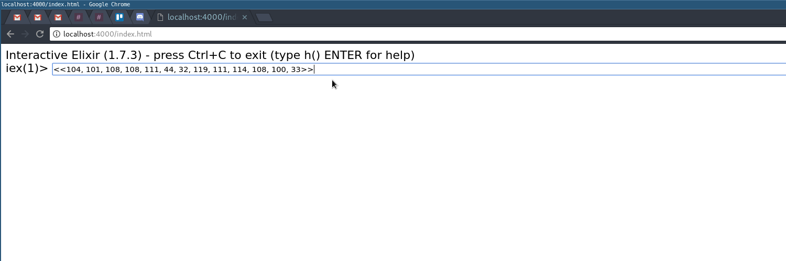

# IEx Over Websockets
Proof of concept for tunneling the IEx shell over different transports.

## Demo

## Try it yourself

* clone repo
* `mix deps.get`
* `iex -S mix`
* point browser to `localhost:4000`

## What's next?
I really want to PR the changes i made to the `IEx.Server` and `IEx.Evaluator`
into Elixir. Will I do it? no probably not.

I also would like to implement this over MQTT, and maybe AMQP for fun.
